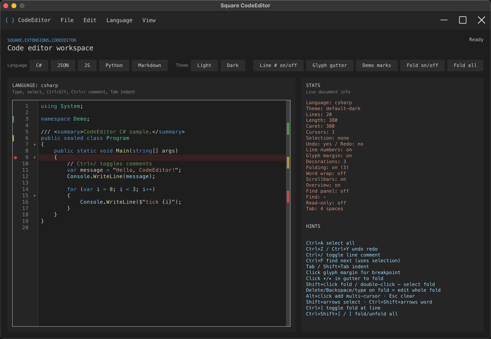

# Square

Square 是一个纯 C#、编译优先、NativeAOT 友好的实验性跨平台桌面 UI 框架。

它借鉴 Vue、HTML 与 CSS 的开发体验，但不是浏览器，也不引入 Vue 运行时或 JavaScript 引擎。`.sqv` / `.sqx` 模板会在编译期由 Roslyn Source Generator 生成普通 C# 组件。

> 项目仍处于早期开发阶段，API 与模板语法可能调整。目前主要验证 Windows / Win32 与 Linux / X11 桌面宿主。

## 截图




## 示例

`Main.sqv`：

```vue
<template>
  <View class="page">
    <Text class="title">Hello {{ Name.Value }}</Text>

    <Input :value="Name" @input="OnNameChanged" />

    <Button ref="SaveButton" @click="OnSave">
      Save
    </Button>

    <Text v-if="Saved.Value">Saved</Text>
  </View>
</template>

<script lang="csharp">
  public ObservableValue<string> Name = new("Square");
  public ObservableValue<bool> Saved = new(false);

  private void OnNameChanged(Event e)
  {
      Name.Value = ((Input)e.Target!).Value;
  }

  private void OnSave()
  {
      Saved.Value = true;
  }
</script>

<style>
  .page {
      display: flex;
      flex-direction: column;
      gap: 12px;
      padding: 16px;
  }

  .title {
      font-size: 20px;
  }
</style>
```

`Program.cs`：

```csharp
using Square.Hosting;

var window = new AppWindow("My App", 800, 600);
window.Load(new Main());

new DesktopApplication(window).Run();
```

## 运行示例

```bash
dotnet restore Square.slnx
dotnet build Square.slnx
dotnet run --project samples/Square.Sample.Vue/Square.Sample.Vue.csproj
```

Debug 模式下可使用 `dotnet watch` 热更新普通 C#、`.sqx` / `.sqv` 模板和组件 `<style>`：

```bash
dotnet watch --project samples/Square.Sample.Vue/Square.Sample.Vue.csproj
```

模板或组件样式变化时，Square 复用顶层生成组件实例并重建其后代，因此顶层 C# 字段和响应式状态会保留；窗口 `Content` / 自定义标题栏需要以生成组件作为顶层根。根组件及后代会重新执行 unload/detach/attach/load 生命周期，生命周期代码应支持重复挂载。后代控件的局部状态、焦点、滚动位置和选择区不保证保留。组件或文件重命名、删除成员及部分 `ref` 结构变化仍可能要求重启。

主示例可选择 CPU Skia 后端：

```bash
dotnet run --project samples/Square.Sample/Square.Sample.csproj -- --backend Skia
```

Windows 主示例也可选择原生 Direct2D HWND 后端：

```powershell
dotnet run --project samples/Square.Sample/Square.Sample.csproj `
  -p:SquareTargetPlatform=Win32 `
  -p:SquareSampleUseDirect2D=true `
  -- --backend Direct2D
```

运行 RichText 示例：

```bash
dotnet run --project samples/Square.Sample.RichText/Square.Sample.RichText.csproj
```

运行测试：

```bash
dotnet test Square.slnx
```

## NativeAOT 发布

Hot Reload 仅用于框架依赖运行时的 Debug 构建，不适用于 Release、trimming 或 NativeAOT 发布。

Windows x64：

```bash
dotnet publish samples/Square.Sample.Vue/Square.Sample.Vue.csproj \
  -c Release \
  -r win-x64 \
  -p:SquareSamplePublishAot=true \
  --self-contained true
```

Linux x64 / X11：

```bash
dotnet publish samples/Square.Sample.Vue/Square.Sample.Vue.csproj \
  -c Release \
  -r linux-x64 \
  -p:SquareSamplePublishAot=true \
  -p:SquareTargetPlatform=X11 \
  --self-contained true
```

## 文档

- [入门指南](docs/Getting-Started.md)
- [SQV / Vue 模板语法](docs/vue-plan.md)
- [SQX 原生语法](docs/Sqx-Spec.md)
- [总体架构](docs/Architecture.md)
- [API 参考](docs/API-Reference.md)
- [CSS 规范](docs/CSS-Spec.md)
- [布局](docs/Layout.md)
- [渲染](docs/Rendering.md)
- [DevTools 调试服务](docs/DevTools.md)
- [Web Server 与静态 HTML](docs/Web-Hosting.md)
- [开发路线](docs/Roadmap.md)

## 项目状态

Square 适合框架设计验证、实验和贡献开发，暂不建议用于生产项目。

当前程序集与 NuGet 包统一使用 `0.1.0`。`docs/` 文档头部的版本号是各文档的独立修订号，不代表包版本。

贡献流程见 [`CONTRIBUTING.md`](CONTRIBUTING.md)。安全问题请按 [`SECURITY.md`](SECURITY.md) 私下报告。

## License

MIT
